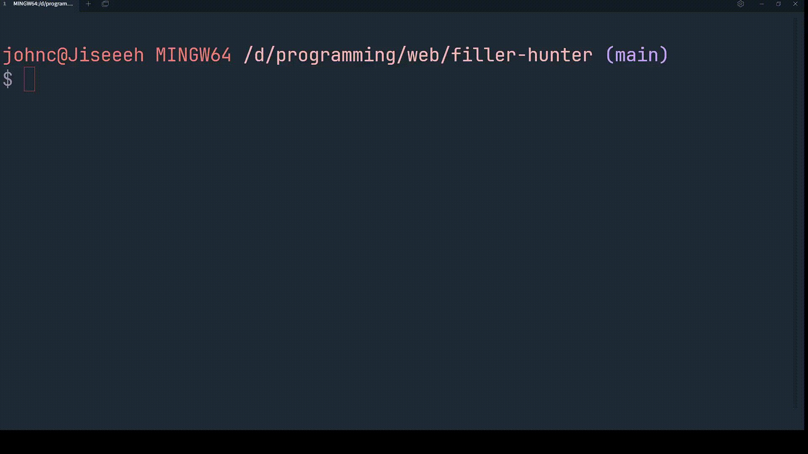

# Filler Hunter 🎯



## Setup

- Clone repo

```bash
git clone https://github.com/Jiseeeh/filler-hunter.git
```

- change dir

```bash
cd filler-hunter
```

- install modules

```bash
pnpm i
```

- run

```bash
node index.js
```
